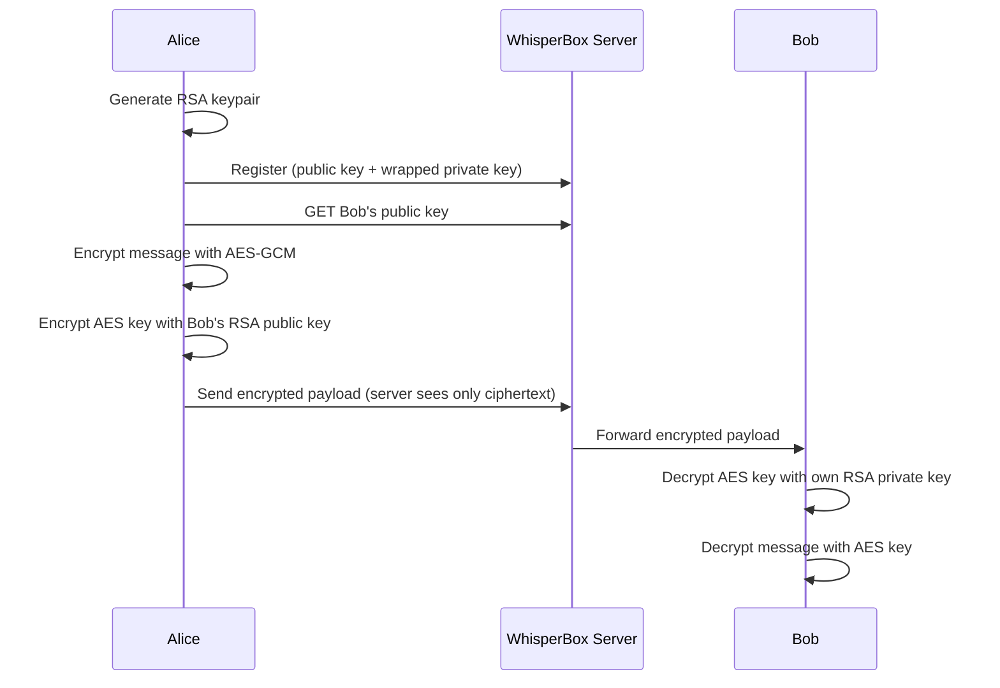

# WhisperBox

WhisperBox is an end-to-end encrypted messaging web app. The React + TypeScript client uses the Web Crypto API in the browser to generate an RSA key pair, protect the PKCS#8 private key with a password-derived AES-GCM envelope (legacy accounts may still use AES-KW unwrap), and exchange messages using hybrid encryption (AES-GCM + RSA-OAEP). The server at `https://whisperbox.koyeb.app` only ever sees ciphertext.

## Development

```bash
npm install
npm run dev
```

Production build:

```bash
npm run build
npm run preview
```

## Architecture



## Encryption flow

### Registration

1. Generate an RSA-OAEP 2048-bit key pair (SHA-256, public exponent 65537).
2. Generate a random 16-byte PBKDF2 salt.
3. Derive a 256-bit AES key from the password using PBKDF2 (SHA-256, 310,000 iterations) and the salt.
4. Export the RSA private key as PKCS#8, encrypt it with **AES-GCM** (random 12-byte IV, 128-bit tag), prefix a short `WB2` magic — then base64 — so PKCS#8 length does not need to satisfy AES-KW’s multiple-of‑8‑byte constraint. **Login** still supports legacy blobs produced with AES-KW.
5. Export the public key as SPKI and base64-encode SPKI, wrapped private key, and salt.
6. Send `POST /auth/register` with username, display name, password, and the three base64 fields.
7. Store the unwrapped `CryptoKey` objects and tokens **only in memory** (Zustand).

### Login

1. `POST /auth/login` returns tokens and the user profile (including wrapped private key and salt).
2. Decode the salt, derive AES keys from the password with the same PBKDF2 parameters, decrypt the PKCS#8 private key (**AES-GCM** for current `WB2` envelopes; **AES-KW** unwrap for older accounts), and import the RSA private `CryptoKey`.
3. Import the RSA public key from the stored SPKI (base64) for encrypting the “copy for self” of each message key.
4. Keep passwords and unwrapped keys out of persistent storage.

### Sending a message

1. Fetch the recipient’s RSA public key (`GET /users/{id}/public-key`).
2. Generate a one-time AES-GCM-256 key and a random 12-byte IV.
3. Encrypt the UTF-8 message with AES-GCM.
4. Encrypt the raw AES key bytes for the recipient with RSA-OAEP.
5. Encrypt the same AES key bytes for the sender with the sender’s public key (`encryptedKeyForSelf`) so outgoing history can be decrypted later.
6. Send the payload over the WebSocket (`message.send`) when connected; otherwise fall back to `POST /messages` and use IndexedDB outbox if needed.

### Receiving / history

1. For each wire payload, base64-decode `ciphertext`, `iv`, and the appropriate RSA-wrapped AES key (`encryptedKey` for incoming, `encryptedKeyForSelf` for your own sent messages).
2. Decrypt the AES key with your RSA private key, import it as AES-GCM, and decrypt the ciphertext.
3. Decode UTF-8 and render in memory (React Query cache only). Plaintext is never written to `localStorage`, `sessionStorage`, or IndexedDB.

## Key management

| What | Where stored | Form |
|------|----------------|------|
| RSA private key | Zustand memory (session only) | `CryptoKey` object |
| RSA wrapped private key | Server (via `/auth/login` user object) | Password-protected PKCS#8 (AES-GCM envelope today; AES-KW legacy), base64 |
| PBKDF2 salt | Server (via user profile) | base64 |
| RSA public key | Server | base64 SPKI |
| AES-GCM message key | Never stored | Ephemeral per message |
| Access token | Zustand memory | JWT string |
| Refresh token | Zustand memory | JWT string |

## Security trade-offs

- **Password change** would require re-wrapping and re-uploading the private key. This is not implemented and is a known limitation.
- **No cross-device sync**: the unwrapped private key exists only in memory for the current tab session; another device must log in and unwrap again.
- **Forgotten password**: there is no recovery; historical ciphertext cannot be decrypted without the wrapping key derived from the password.
- **Refresh token in memory**: a full page reload clears tokens and requires logging in again; nothing is stored in `localStorage` by design.
- **No forward secrecy**: one long-lived RSA key pair is used; compromise of the long-term private key exposes decryption of past messages.

## Known limitations

The trade-offs above apply, plus: no read receipts, no typing indicators, no attachments, and no server-side message deletion in this client.

## Tech stack

- React 19 + TypeScript + Vite
- Tailwind CSS v4 with extended theme colors
- Web Crypto API only (no external crypto npm packages)
- `idb` for optional encrypted outbox entries when sending fails
- TanStack Query v5, Zustand, React Router, Axios with refresh interceptor
- WebSocket `wss://whisperbox.koyeb.app/ws?token=…` for real-time messaging and presence

## API

The client targets `https://whisperbox.koyeb.app` (`src/api/client.ts`). REST and WebSocket behavior match the published specification.

- [Interactive docs](https://whisperbox.koyeb.app/docs)
- [OpenAPI JSON](https://whisperbox.koyeb.app/openapi.json)
